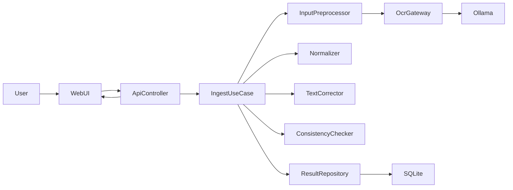
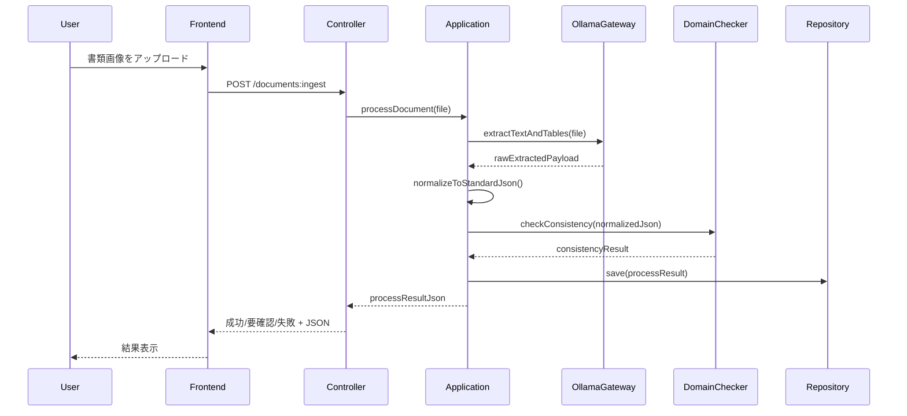

# Design Document

## Overview
本機能は、貿易書類の画像アップロードから OCR 抽出、JSON 正規化、数値整合チェックまでを一連で提供する PoC 機能である。  
対象利用者は貿易実務担当者および営業事務であり、手動転記を削減し、会社ごとの差異がある書類でも統一フォーマットで扱える状態を目指す。

本設計は `controller / application / domain / infrastructure` の4層で責務を分離し、Ollama 連携や SQLite 永続化などの外部依存を内側の業務ルールから分離する。PoC として過剰な抽象化は避け、実装可能性を優先する。

### Goals
- 書類アップロードから結果確認までを単一フローで完結させる
- 抽出結果を自社標準 JSON に正規化する
- 単価・数量・小計・税・合計の整合判定を結果に含める

### Non-Goals
- セキュリティ/監査の本格実装
- 本番可用性を前提とした可観測性設計
- HITL 介入基準の詳細仕様化

## Boundary Commitments

### This Spec Owns
- 書類画像の受付 API と処理開始
- OCR 抽出結果の構造化 JSON 生成
- 標準キーへの正規化ルール適用
- 数値整合判定ロジックと判定結果の返却
- 利用者が結果状態（成功/要確認/失敗）を判別できるレスポンス

### Out of Boundary
- 認証/認可、監査ログ、機密情報管理の本格要件
- 高可用性構成、リトライ制御、タイムアウト制御の最適化
- 外部業務システム側での JSON 受領後処理

### Allowed Dependencies
- FastAPI（API エンドポイント実装）
- Ollama（`llama3.2-vision` への推論依頼）
- SQLite + SQLAlchemy + Alembic（処理単位と結果の保存）
- React クライアント（結果表示）

### Revalidation Triggers
- JSON 出力スキーマ（標準キー、整合判定結果）の変更
- 数値整合判定ルールの変更
- Ollama 入出力契約の変更
- controller/application/domain/infrastructure の依存方向変更

## Architecture

### Architecture Pattern & Boundary Map
- Selected pattern: DDD Layered Architecture
- Domain/feature boundaries: 入出力は controller、業務フローは application、判定ルールは domain、外部接続は infrastructure
- Existing patterns preserved: steering の4層分離方針
- New components rationale: OCR adapter、Normalizer、ConsistencyChecker を分離して責務を固定
- New components rationale: InputPreprocessor（PDF/Excel画像化）、TextCorrectionService（補助テキスト補正）を追加
- Steering compliance: `tech.md` と `structure.md` の依存方向ルールに準拠



### Technology Stack

| Layer | Choice / Version | Role in Feature | Notes |
|-------|------------------|-----------------|-------|
| Frontend / CLI | React (latest stable) | 書類投入と結果参照UI | PoC最小画面 |
| Backend / Services | FastAPI (latest stable), Python 3.14 | API と処理オーケストレーション | 非同期処理を積極利用 |
| Data / Storage | SQLite, SQLAlchemy, Alembic | 処理結果と状態の保存 | PoC 前提 |
| Messaging / Events | なし | 非同期キューは未導入 | 対象外 |
| Infrastructure / Runtime | Ollama + llama3.2-vision | OCR 抽出エンジン | 同一NW・認証なし |
| Document Preprocess | Pillow, pypdf, openpyxl | PDF/Excel を画像主系へ統一し補助テキスト抽出 | MVP方針 |

## File Structure Plan

### Directory Structure
```text
frontend/
└── src/
    ├── features/document-ingest/
    │   ├── api/documentIngestApi.ts        # バックエンドAPI呼び出し
    │   ├── components/UploadForm.tsx       # 書類アップロードUI
    │   ├── components/ResultPanel.tsx      # JSON/整合判定表示
    │   └── schema/resultViewModel.ts       # 画面表示用型
    └── shared/http/client.ts               # OpenAPIスタブ利用のHTTPクライアント

backend/
└── src/
    ├── controller/document_ingest_controller.py           # 受付/結果参照API
    ├── application/usecases/process_document_usecase.py   # 処理全体のオーケストレーション
    ├── application/services/json_normalization_service.py  # 標準キーへの正規化
    ├── domain/services/consistency_checker.py             # 数値整合判定
    ├── domain/models/document_result.py                   # ドメインモデル
    ├── infrastructure/ollama/ollama_ocr_gateway.py        # Ollama連携
    ├── infrastructure/persistence/models.py               # SQLAlchemyモデル
    ├── infrastructure/persistence/repository.py           # 永続化実装
    └── infrastructure/persistence/migrations/             # Alembic migration
```

### Modified Files
- `backend/src/app/main.py` — ルーター登録
- `frontend/src/app/routes.tsx` — 画面ルート追加

## System Flows



## Requirements Traceability

| Requirement | Summary | Components | Interfaces | Flows |
|-------------|---------|------------|------------|-------|
| 1.1 | 対応形式アップロードで処理開始 | UploadForm, document_ingest_controller, process_document_usecase | POST `/documents:ingest` | Sequence |
| 1.2 | 非対応/破損時エラー返却 | document_ingest_controller | Error response schema | Sequence |
| 1.3 | 処理中状態の可視化 | ResultPanel, document_ingest_controller | GET `/documents/{id}` | Sequence |
| 1.4 | 一意処理ID付与 | process_document_usecase, repository | DocumentProcessId contract | Sequence |
| 2.1 | OCR結果からJSON生成 | ollama_ocr_gateway, process_document_usecase | OcrExtract payload | Sequence |
| 2.2 | 抽出不可項目の識別 | json_normalization_service | MissingField contract | Sequence |
| 2.3 | 項目名と値対応保持 | document_result model | Normalized JSON schema | Sequence |
| 3.1 | 会社固有表現の標準化 | json_normalization_service | Normalization rules contract | Sequence |
| 3.2 | 未対応項目を識別返却 | json_normalization_service, ResultPanel | UnmappedField contract | Sequence |
| 3.3 | 同義表現を同一キー化 | json_normalization_service | Canonical key mapping | Sequence |
| 4.1 | 単価*数量と小計判定 | consistency_checker | Line consistency contract | Sequence |
| 4.2 | 小計+税と合計判定 | consistency_checker | Total consistency contract | Sequence |
| 4.3 | 不一致箇所と期待値返却 | consistency_checker, ResultPanel | Inconsistency detail schema | Sequence |
| 4.4 | 判定結果をJSONに含める | process_document_usecase, document_result | Result envelope schema | Sequence |
| 5.1 | JSONと判定結果を同時提示 | ResultPanel | Result response view model | Sequence |
| 5.2 | 要再確認/再処理の明示 | document_ingest_controller, ResultPanel | Status enum contract | Sequence |
| 5.3 | 成功/要確認/失敗の区別 | document_result, ResultPanel | Status enum contract | Sequence |
| 6.1 | PDF/Excelを画像主系投入 | document_input_preprocessor, ollama_ocr_gateway | preprocess contract | Sequence |
| 6.2 | 補助テキストで補正 | text_correction_service, process_document_usecase | correction contract | Sequence |
| 6.3 | 不一致時の要確認判定 | process_document_usecase, consistency_checker | status contract | Sequence |

## Components and Interfaces

| Component | Domain/Layer | Intent | Req Coverage | Key Dependencies (P0/P1) | Contracts |
|-----------|--------------|--------|--------------|--------------------------|-----------|
| DocumentIngestController | controller | 受付APIと結果返却 | 1.1, 1.2, 1.3, 5.2 | ProcessDocumentUseCase (P0) | API |
| ProcessDocumentUseCase | application | OCR〜判定までの統制 | 1.4, 2.1, 2.3, 4.4 | OcrGateway (P0), NormalizationService (P0), ConsistencyChecker (P0), Repository (P1) | Service |
| JsonNormalizationService | application | 標準キーへ正規化 | 2.2, 3.1, 3.2, 3.3 | MappingRules (P1) | Service |
| ConsistencyChecker | domain | 数値整合判定 | 4.1, 4.2, 4.3 | DomainModel (P0) | Service |
| OllamaOcrGateway | infrastructure | OCR抽出外部連携 | 2.1 | Ollama (P0) | Service |
| DocumentResultRepository | infrastructure | 結果永続化 | 1.4, 4.4, 5.3 | SQLite (P1) | Service |
| ResultPanel | frontend | JSONと判定表示 | 1.3, 5.1, 5.2, 5.3 | documentIngestApi (P0) | State |
| DocumentInputPreprocessor | application | PDF/Excelを画像主系へ変換し補助テキスト抽出 | 6.1, 6.2 | pypdf/openpyxl/Pillow (P1) | Service |
| TextCorrectionService | application | 補助テキストで抽出値補正 | 6.2, 6.3 | ProcessDocumentUseCase (P0) | Service |

### controller

#### DocumentIngestController
| Field | Detail |
|-------|--------|
| Intent | ファイル受付と結果レスポンス境界の提供 |
| Requirements | 1.1, 1.2, 1.3, 5.2 |

**Responsibilities & Constraints**
- 入力ファイルの形式検証
- ユースケース呼び出しとHTTPレスポンス変換
- 例外をエラーコード付きレスポンスへ正規化

##### API Contract
| Method | Endpoint | Request | Response | Errors |
|--------|----------|---------|----------|--------|
| POST | /api/documents/ingest | multipart/form-data(file) | IngestResultResponse | 400, 422, 500 |
| GET | /api/documents/{process_id} | path param | IngestResultResponse | 404, 500 |

### application

#### ProcessDocumentUseCase
| Field | Detail |
|-------|--------|
| Intent | OCR抽出、正規化、整合判定、保存を順序実行 |
| Requirements | 1.4, 2.1, 2.3, 4.4 |

##### Service Interface
```python
class ProcessDocumentUseCase:
    async def execute(self, file_bytes: bytes, filename: str) -> "IngestResult":
        ...
```
- Preconditions: 受付済みファイルであること
- Postconditions: process_id と結果状態を返すこと
- Invariants: 出力JSONに status と consistency_result を含めること

#### JsonNormalizationService
| Field | Detail |
|-------|--------|
| Intent | 抽出データを標準キーへマッピング |
| Requirements | 2.2, 3.1, 3.2, 3.3 |

### domain

#### ConsistencyChecker
| Field | Detail |
|-------|--------|
| Intent | 金額計算の整合判定を実施 |
| Requirements | 4.1, 4.2, 4.3 |

##### Service Interface
```python
class ConsistencyChecker:
    def evaluate(self, normalized_json: dict) -> "ConsistencyResult":
        ...
```
- Preconditions: 単価/数量/小計等の対象値が正規化済みであること
- Postconditions: 判定可否と不一致詳細を返すこと
- Invariants: 判定不能項目も理由付きで返すこと

### infrastructure

#### OllamaOcrGateway
| Field | Detail |
|-------|--------|
| Intent | Ollama に書類画像を渡して抽出結果を受け取る |
| Requirements | 2.1 |

#### DocumentResultRepository
| Field | Detail |
|-------|--------|
| Intent | 処理結果と状態を SQLite に保存/取得する |
| Requirements | 1.4, 4.4, 5.3 |

## Data Models

### Domain Model
- `DocumentResult`:
  - `process_id`
  - `status` (`SUCCESS` / `NEEDS_REVIEW` / `FAILED`)
  - `normalized_payload`
  - `consistency_result`
  - `unmapped_fields`

### Logical Data Model
- `document_processes` テーブル
  - `process_id` (PK)
  - `original_filename`
  - `status`
  - `normalized_payload_json`
  - `consistency_result_json`
  - `created_at`

### Data Contracts & Integration
- API Data Transfer:
  - `IngestResultResponse`: `{ process_id, status, normalized_payload, consistency_result, warnings }`
- Cross-Service Data Management:
  - 単一サービス内処理のため分散トランザクションは扱わない

## Error Handling

### Error Strategy
- 4xx: 入力不正、未対応形式、取得不能ID
- 5xx: OCR連携失敗、永続化失敗、予期しない例外
- 422: 判定不能な入力構造（値欠損・数値化不可）

## Testing Strategy

### Unit Tests
- `JsonNormalizationService` が同義項目を標準キーへ統一すること（3.1, 3.3）
- `ConsistencyChecker` が明細一致/不一致を判定すること（4.1, 4.3）
- `ConsistencyChecker` が税込み合計を判定すること（4.2）

### Integration Tests
- `POST /api/documents/ingest` で process_id と status が返ること（1.1, 1.4）
- OCR欠損時に抽出不可項目が返ること（2.2）
- 結果レスポンスに consistency_result が含まれること（4.4, 5.1）

### E2E/UI Tests
- ファイル投入から結果表示まで完走できること（1.1, 5.1）
- 不一致時に「要確認」が表示されること（5.2, 5.3）

