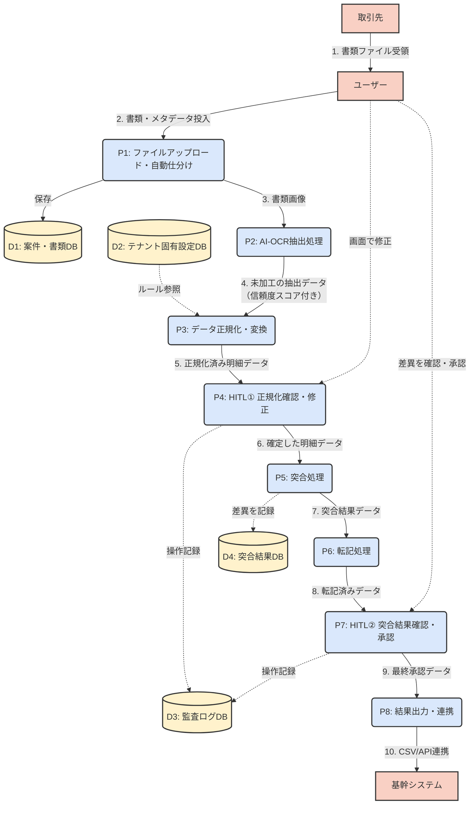

```mermaid
flowchart TD
    classDef entity fill:#f9d0c4,stroke:#333,stroke-width:2px;
    classDef db fill:#fff2cc,stroke:#333,stroke-width:2px;
    classDef process fill:#dae8fc,stroke:#333,stroke-width:2px;

    E1[取引先]:::entity
    E2[ユーザー]:::entity
    E3[基幹システム]:::entity

    D1[(D1: 案件・書類DB)]:::db
    D2[(D2: テナント固有設定DB)]:::db
    D3[(D3: 監査ログDB)]:::db
    D4[(D4: 突合結果DB)]:::db

    P1(P1: ファイルアップロード・自動仕分け):::process
    P2(P2: AI-OCR抽出処理):::process
    P3(P3: データ正規化・変換):::process
    P4(P4: HITL① 正規化確認・修正):::process
    P5(P5: 突合処理):::process
    P6(P6: 転記処理):::process
    P7(P7: HITL② 突合結果確認・承認):::process
    P8(P8: 結果出力・連携):::process

    E1 -- "1. 書類ファイル受領" --> E2
    E2 -- "2. 書類・メタデータ投入" --> P1
    P1 -- "保存" --> D1
    P1 -- "3. 書類画像" --> P2
    P2 -- "4. 未加工の抽出データ\n（信頼度スコア付き）" --> P3
    D2 -. "ルール参照" .-> P3
    P3 -- "5. 正規化済み明細データ" --> P4
    E2 -. "画面で修正" .-> P4
    P4 -. "操作記録" .-> D3
    P4 -- "6. 確定した明細データ" --> P5
    P5 -. "差異を記録" .-> D4
    P5 -- "7. 突合結果データ" --> P6
    P6 -- "8. 転記済みデータ" --> P7
    E2 -. "差異を確認・承認" .-> P7
    P7 -. "操作記録" .-> D3
    P7 -- "9. 最終承認データ" --> P8
    P8 -- "10. CSV/API連携" --> E3
```
